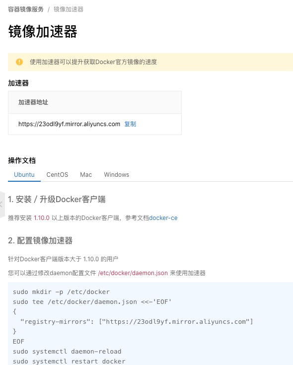

# docker 相关的笔记

## ubuntu install docker
- 一键安装 https://docs.docker.com/engine/install/ubuntu/#install-using-the-convenience-script
```
curl -fsSL https://get.docker.com -o get-docker.sh
sudo sh ./get-docker.sh
```

- 命令安装 https://docs.docker.com/engine/install/ubuntu/#installation-methods
```
sudo apt-get update
sudo apt-get install -y \
    ca-certificates \
    curl \
    gnupg \
    lsb-release
    
sudo mkdir -m 0755 -p /etc/apt/keyrings
curl -fsSL https://download.docker.com/linux/ubuntu/gpg | sudo gpg --dearmor -o /etc/apt/keyrings/docker.gpg

echo \
  "deb [arch=$(dpkg --print-architecture) signed-by=/etc/apt/keyrings/docker.gpg] https://download.docker.com/linux/ubuntu \
  $(lsb_release -cs) stable" | sudo tee /etc/apt/sources.list.d/docker.list > /dev/null
  
sudo apt-get update

sudo apt-get install docker-ce docker-ce-cli containerd.io docker-buildx-plugin docker-compose-plugin

sudo docker run hello-world
```

## 阿里云镜像仓库
- 我的地址
> https://23odl9yf.mirror.aliyuncs.com
- 查询地址
> https://cr.console.aliyun.com/cn-zhangjiakou/instances/mirrors
- 使用方法

- 案例: https://23odl9yf.mirror.aliyuncs.com加到"registry-mirrors"
```
  "registry-mirrors": ["https://23odl9yf.mirror.aliyuncs.com"],
```


## 查看docker容器的内存占用
- https://www.cnblogs.com/duanxz/p/10247481.html
- 步骤：
  - docker ps -a 找到容器的container id
  - ps -ef | grep [container id] 找到对应的进程
  - top -p [pid]
```
PID：进程的ID
USER：进程所有者
PR：进程的优先级别，越小越优先被执行
NInice：值
VIRT：进程占用的虚拟内存
RES：进程占用的物理内存
SHR：进程使用的共享内存
S：进程的状态。S表示休眠，R表示正在运行，Z表示僵死状态，N表示该进程优先值为负数
%CPU：进程占用CPU的使用率
%MEM：进程使用的物理内存和总内存的百分比
TIME+：该进程启动后占用的总的CPU时间，即占用CPU使用时间的累加值。
COMMAND：进程启动命令名称
```
    - ps -e -o 'pid,comm,args,pcpu,rsz,vsz,stime,user,uid' | grep [pid]   其中rsz为实际内存    

## 查看镜像每一层
docker history xxx

## 免sudo使用docker命令
- https://www.cnblogs.com/mafeng/p/8683914.html

如果还没有 docker group 就添加一个：
>sudo groupadd docker

将用户加入该 group 内。然后退出并重新登录就生效啦。
> sudo gpasswd -a ${USER} docker

重启 docker 服务
> sudo service docker restart

切换当前会话到新 group 或者重启 X 会话
>newgrp - docker

注意:最后一步是必须的，否则因为 groups 命令获取到的是缓存的组信息，刚添加的组信息未能生效，所以 docker images 执行时同样有错。

## ubuntu 设置默认密码问题
- 上面也会需要输入密码，或者进入root，都需要有密码
- 新设密码 ```su root``` 然后输入两遍
- 进入root ```su root``` 然后输入上面的密码


##  docker启动/重启/关闭命令
启动 ```systemctl start docker```
守护进程重启```sudo systemctl daemon-reload```

重启docker服务```systemctl restart  docker```
重启docker服务```sudo service docker restart```

关闭docker```service docker stop```
关闭docker```systemctl stop docker```
